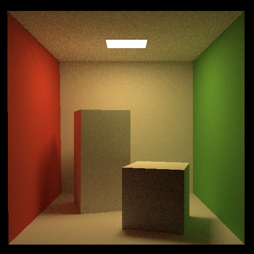
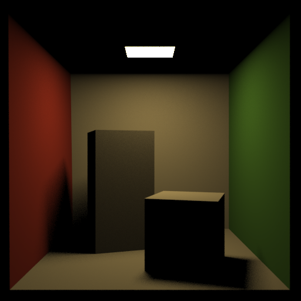
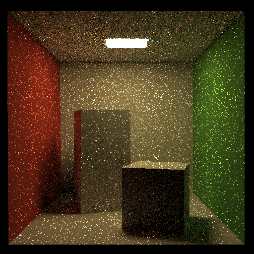
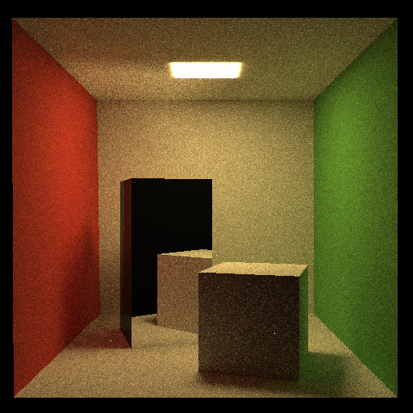
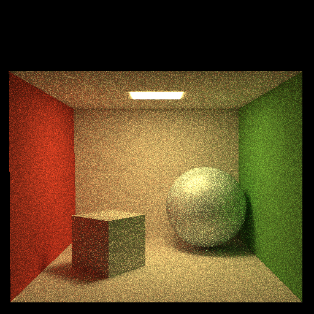
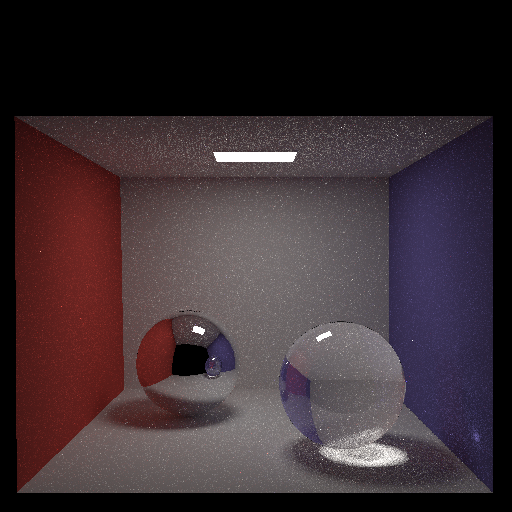

## Path (final submission)

Please fill this out and submit your work to Gradescope by the deadline.

### Output Comparison

Run the program with the specified `.ini` config file to compare your output against the reference images. The program should automatically save to the correct path for the images to appear in the table below.

If you are not using the Qt framework, you may also produce your outputs otherwise so long as you place them in the correct directories as specified in the table. In this case, please also describe how your code can be run to reproduce your outputs

> Qt Creator users: If your program can't find certain files or you aren't seeing your output images appear, make sure to: 
>
> 1. Set your working directory to the project directory
> 2. Set the command-line argument in Qt Creator to `template_inis/final/<ini_file_name>.ini`

Note that your outputs do **not** need to exactly match the reference outputs. There are several factors that may result in minor differences, such as your choice of tone mapping and randomness.

Please do not attempt to duplicate the given reference images; we have tools to detect this.

|         `.ini` File To Produce Output         |                 Expected Output (No Gamma)                  |                                   Expected Output                                    |                                                                         Your Output                                                                         |
| :-------------------------------------------: | :----------------------------------------------------------: | :----------------------------------------------------------------------------------: | :---------------------------------------------------------------------------------------------------------------------------------------------------------: |
|         cornell_box_full_lighting.ini         |          |          |                  |
|     cornell_box_direct_lighting_only.ini      |   |   |           |
| cornell_box_full_lighting_low_probability.ini |  |  |  |
|                  mirror.ini                   |                                     |                                     |                                                                        |
|                  glossy.ini                   |                                     |                                     |                                                                        |
|                refraction.ini                 |                                 |                                 |                                                                |

> Note: The reference images above were produced using the [Extended Reinhard](https://64.github.io/tonemapping/#extended-reinhard) tone mapping function with minor gamma correction. You may choose to use another mapping function or omit gamma correction.

### Implementation Locations

Please link to the lines (in GitHub) where the implementation of these features start:

- [Diffuse Reflection](https://github.com/brown-cs-224/path-LizzySMB/blob/9abfe56aa43d64077cabee75cab451ee3ba1f4a0/pathtracer.cpp#L287)
- [Glossy Reflection](https://github.com/brown-cs-224/path-LizzySMB/blob/9abfe56aa43d64077cabee75cab451ee3ba1f4a0/pathtracer.cpp#L248)
- [Mirror Reflection](https://github.com/brown-cs-224/path-LizzySMB/blob/9abfe56aa43d64077cabee75cab451ee3ba1f4a0/pathtracer.cpp#L242)
- [Refraction (with Fresnel refletion)](https://github.com/brown-cs-224/path-LizzySMB/blob/9abfe56aa43d64077cabee75cab451ee3ba1f4a0/pathtracer.cpp#L159)
- [Soft Shadows](https://github.com/brown-cs-224/path-LizzySMB/blob/9abfe56aa43d64077cabee75cab451ee3ba1f4a0/pathtracer.cpp#L395)
- [Illumination](https://github.com/brown-cs-224/path-LizzySMB/blob/9abfe56aa43d64077cabee75cab451ee3ba1f4a0/pathtracer.cpp#L109)
- [Russian Roulette path termination](https://github.com/brown-cs-224/path-LizzySMB/blob/9abfe56aa43d64077cabee75cab451ee3ba1f4a0/pathtracer.cpp#L145)
- [Event Splitting](https://github.com/brown-cs-224/path-LizzySMB/blob/9abfe56aa43d64077cabee75cab451ee3ba1f4a0/pathtracer.cpp#L140)
- [Tone Mapping](https://github.com/brown-cs-224/path-LizzySMB/blob/9abfe56aa43d64077cabee75cab451ee3ba1f4a0/pathtracer.cpp#L84)
- [Importance Sampling](https://github.com/brown-cs-224/path-LizzySMB/blob/9abfe56aa43d64077cabee75cab451ee3ba1f4a0/pathtracer.cpp#L319) [pdf here](https://github.com/brown-cs-224/path-LizzySMB/blob/9abfe56aa43d64077cabee75cab451ee3ba1f4a0/pathtracer.cpp#L268)
- [Depth of Field](https://github.com/brown-cs-224/path-LizzySMB/blob/0a2a78706731c68a299aa17c413c14f1df9bbdb4/pathtracer.cpp#L58)
- [Attenuate Refracted Paths](https://github.com/brown-cs-224/path-LizzySMB/blob/9abfe56aa43d64077cabee75cab451ee3ba1f4a0/pathtracer.cpp#L210)

### Design Choices

Please list all the features your path tracer implements.
Diffuse, Glossy, and Mirror Reflections, Refraction with Fresnel reflection, Soft Shadows, Indirect Illumination, Direct Lighting, Russian Roulette Path Termination, Event Splitting, Tone Mapping, Importance Sampling, Depth of Field, and Refracted Path Attenuation.

### Extra Features

Briefly explain your implementation of any extra features, provide output images, and describe what each image demonstrates.

I implemented importance sampling for clearer images. Here is an example of regular vs. importance sampling on the glossy image.

I tried to implement diffuse brdf importance sampling as well, but I'm honestly not sure if what I have there is just regular sampling.

I also used Beer-Lambert absorption to implement attenuated refracted paths. Here's a before and after: 

For depth of field, I added a lens and focal distance that the user can adjust to create different blurs and focuses as the virtual film plane and lens radius are adjusted. Some examples:

Focal distance: 10, Lens radius: 0.01

Focal distance: 10, Lens radius: 0.1

Focal distance: 10, Lens radius: 1

Focal distance: 1, Lens radius: 0.1

Focal distance: 0.5, Lens radius: 0.1

### Collaboration/References
Beer-Lambert: https://www.geeksforgeeks.org/physics/beer-lambert-law/

### Known Bugs
N/A
